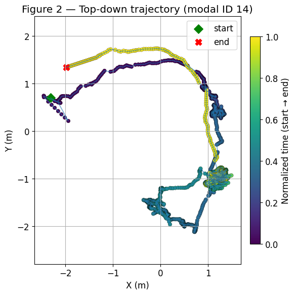
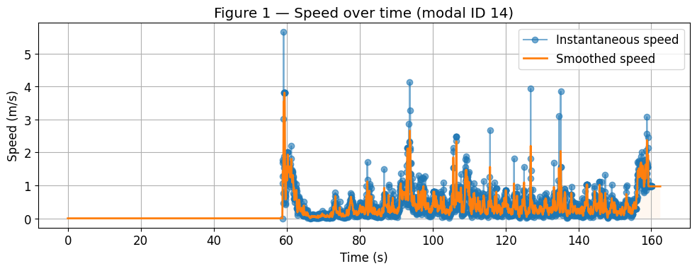
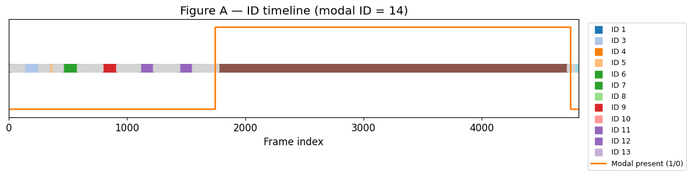

# Human Tracking in 3D Point Clouds

## Overview

This project implements a complete pipeline for detecting,
tracking, and analyzing human motion in sequential 3D point cloud
(PCD) data.

The pipeline consists of:

1. Binary PCD parsing
2. Voxel downsampling
3. DBSCAN clustering
4. Kalman Filter tracking
5. Hungarian data association
6. Motion analysis and visualization

---

## Pipeline

PCD Files
    ↓
Downsampling
    ↓
DBSCAN Detection
    ↓
Centroid Extraction
    ↓
Kalman Filter Prediction
    ↓
Hungarian Assignment
    ↓
Trajectory & Velocity Estimation

---

## Installation

pip install -r requirements.txt

---

## Usage

python scripts/run_tracking.py

python scripts/generate_plots.py

---

## Results

### Trajectory

The figure below shows the reconstructed top-down trajectory of the tracked human obtained from Kalman-filtered centroid estimates.

### Velocity

Instantaneous and smoothed human speed estimates over time. The Kalman filter reduces noise and provides a stable velocity profile.

### ID Timeline

Timeline of assigned track IDs throughout the sequence. The dominant track remains stable for most frames, indicating successful temporal association.

## Tracking Model

State Vector:

x = [x,y,z,vx,vy,vz]^T

Motion Model:

x_k = F x_{k-1}

Measurement:

z_k = H x_k

Kalman Filter:
Prediction → Update → Association

---

## Future Work

- Multi-human tracking
- HDBSCAN clustering
- UKF / Particle Filter
- Sensor fusion
- ROS integration
